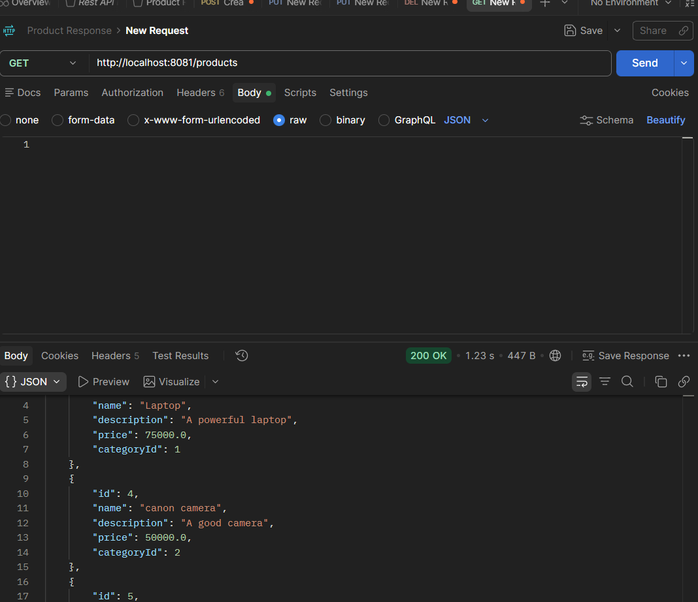
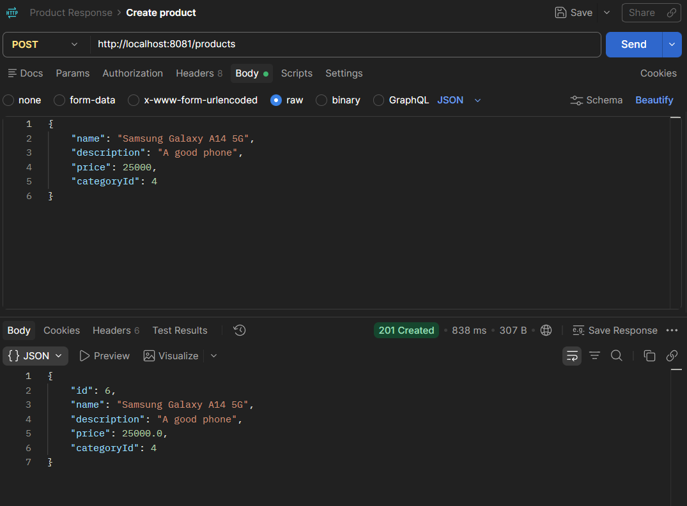
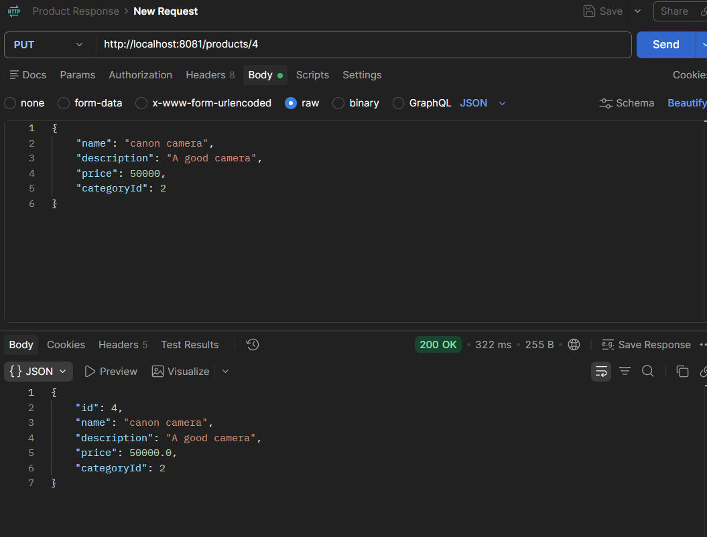
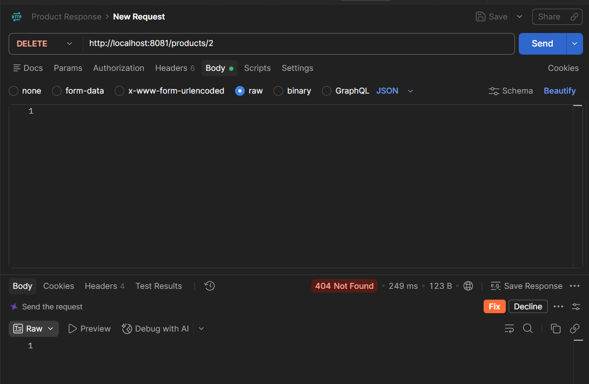

# 🛒 Spring Boot E-Commerce REST API

A RESTful e-commerce backend built with Spring Boot, MySQL, JPA, and MapStruct.

This project was built as a learning project based on CodeWithMosh's Spring Boot course to practice building REST APIs, database integration, DTOs, mapping, and CRUD operations.

## 🚀 Features

- RESTful API development with Spring Boot
- Product CRUD operations
- User management
- Product filtering by category
- DTO-based request and response handling
- Entity-to-DTO mapping using MapStruct
- MySQL database integration with Spring Data JPA
- Database migrations using Flyway
- Request validation and HTTP status handling
- Password change functionality
- REST API testing with Postman

## 🛠️ Tech Stack

### Backend

- Java
- Spring Boot
- Spring Web
- Spring Data JPA
- Hibernate

### Database

- MySQL
- Flyway

### Libraries & Tools

- MapStruct
- Lombok
- Maven
- Postman
- IntelliJ IDEA
- Git & GitHub

## 📁 Project Structure

```text
src
└── main
    ├── java
    │   └── com.codewithmosh.store
    │       ├── controllers
    │       ├── dtos
    │       ├── entities
    │       ├── mappers
    │       ├── repositories
    │       └── StoreApplication.java
    │
    └── resources
        ├── templates
        ├── application.yaml
        └── db
            └── migration
```

### Main Layers

- **Controllers** — Handle HTTP requests and API endpoints
- **DTOs** — Define request and response data
- **Entities** — Represent database tables
- **Repositories** — Handle database operations using Spring Data JPA
- **Mappers** — Convert between entities and DTOs using MapStruct
- **Resources** — Application configuration, templates, and database migrations

## 🔗 API Endpoints

### Products

| Method | Endpoint | Description |
|--------|----------|-------------|
| GET | `/products` | Get all products |
| GET | `/products/{id}` | Get a product by ID |
| GET | `/products?categoryId={categoryId}` | Filter products by category |
| POST | `/products` | Create a new product |
| PUT | `/products/{id}` | Update a product |
| DELETE | `/products/{id}` | Delete a product |

### Users

| Method | Endpoint | Description |
|--------|----------|-------------|
| GET | `/users` | Get all users |
| GET | `/users/{id}` | Get a user by ID |
| POST | `/users` | Create a new user |
| POST | `/users/{id}` | Update a user |
| DELETE | `/users/{id}` | Delete a user |
| POST | `/users/{id}/change-password` | Change user password |

## 🗄️ Database

This project uses **MySQL** as the relational database.

### Database Configuration

Create a MySQL database named:

```sql
CREATE DATABASE store_api;
```

The application connects to MySQL through:

```text
src/main/resources/application.yaml
```

The database schema is managed using **Flyway database migrations**.

### Main Tables

- `users` — Stores user information
- `profiles` — Stores user profile information
- `addresses` — Stores user addresses
- `categories` — Stores product categories
- `products` — Stores product information
- `wishlist` — Stores wishlist data

## ⚙️ Setup & Installation

### 1. Clone the repository

```bash
git clone https://github.com/soumi2004/spring-boot-store-api.git
cd spring-boot-store-api
```

### 2. Create the MySQL database

```sql
CREATE DATABASE store_api;
```

### 3. Configure the database password

Set the `DB_PASSWORD` environment variable with your MySQL password.

The application uses this variable in `application.yaml` instead of storing the password directly in the source code.

### 4. Build the project

```bash
mvn clean install
```

### 5. Run the application

```bash
mvn spring-boot:run
```

The API will be available at:

```text
http://localhost:8081
```

### 6. Test the API

You can use **Postman** to test the available REST API endpoints.

## 📸 API Testing

The REST APIs were tested using Postman.

### Get All Products



### Create Product



### Update Product



### Delete Product



## 📚 What I Learned

Through this project, I practiced:

- Building REST APIs with Spring Boot
- Creating controllers and REST endpoints
- Working with HTTP methods and status codes
- Connecting Spring Boot applications to MySQL
- Using Spring Data JPA and Hibernate
- Working with entities and repositories
- Using DTOs for API requests and responses
- Mapping entities and DTOs using MapStruct
- Implementing CRUD operations
- Handling relationships between entities
- Working with database migrations using Flyway
- Testing APIs using Postman
- Managing a Java project with Maven
- Using Git and GitHub for version control

## 🎯 Project Goals

The main goal of this project was to gain practical experience in backend development and understand how to build and structure a RESTful API using the Spring Boot ecosystem.

## 👩‍💻 Author

**Soumili**

Computer Science & Engineering Student

GitHub: [soumi2004](https://github.com/soumi2004)